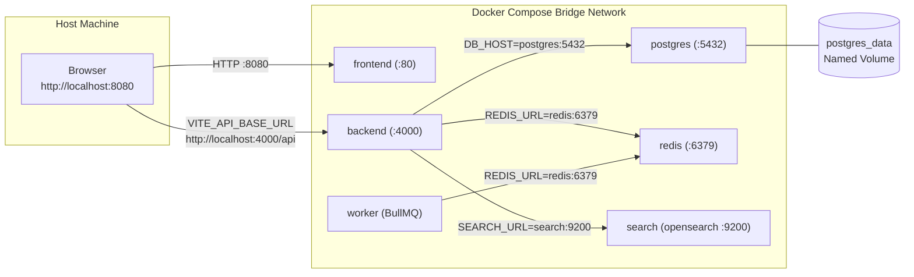
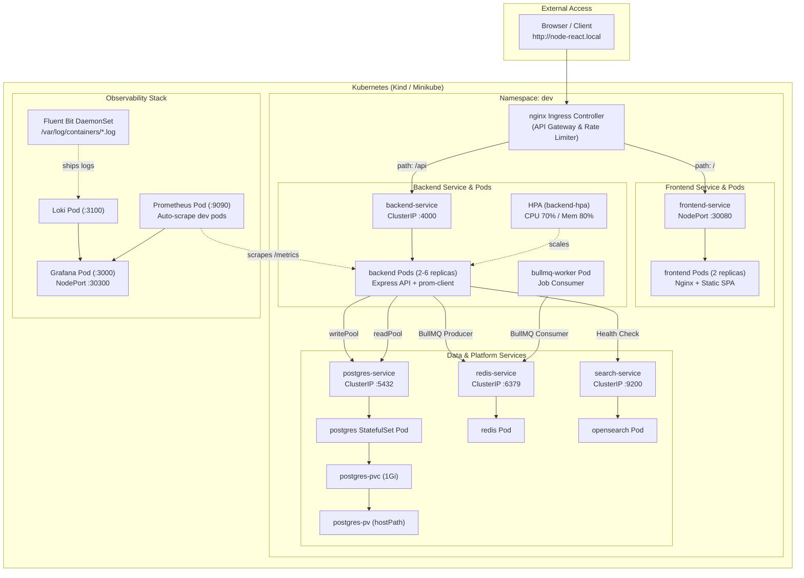
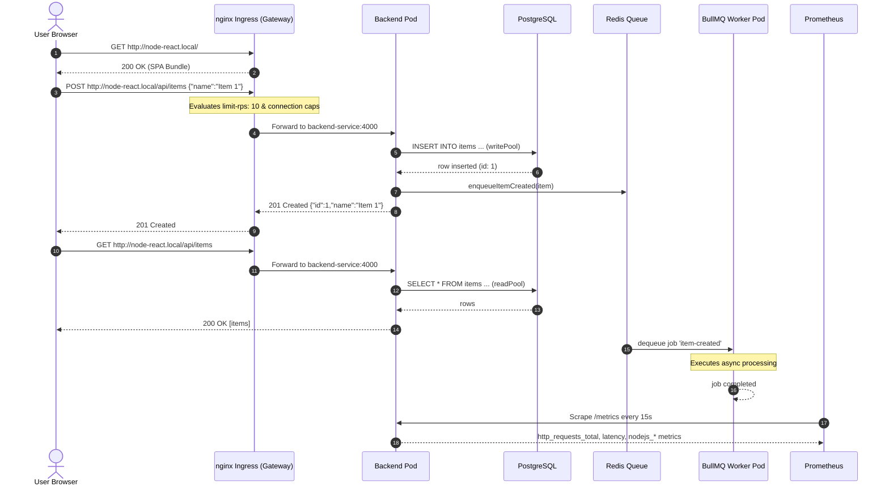

# System Architecture & Flow Documentation

## 1. Local Containerized Topology (Docker Compose)

```mermaid
flowchart LR
    subgraph Host["Host Machine"]
        Browser["Browser<br/>http://localhost:8080"]
    end

    subgraph Bridge["Docker Compose Bridge Network"]
        Frontend["frontend (:80)"]
        Backend["backend (:4000)"]
        Worker["worker (BullMQ)"]
        Postgres["postgres (:5432)"]
        Redis["redis (:6379)"]
        Search["search (opensearch :9200)"]
    end

    Volume[("postgres_data<br/>Named Volume")]

    Browser -->|"HTTP :8080"| Frontend
    Browser -->|"VITE_API_BASE_URL<br/>http://localhost:4000/api"| Backend
    Backend -->|"DB_HOST=postgres:5432"| Postgres
    Backend -->|"REDIS_URL=redis:6379"| Redis
    Backend -->|"SEARCH_URL=search:9200"| Search
    Worker -->|"REDIS_URL=redis:6379"| Redis
    Postgres --- Volume
```

---

## 2. Kubernetes Cluster Topology (dev namespace)

```mermaid
flowchart TB
    subgraph External["External Access"]
        Client["Browser / Client<br/>http://node-react.local"]
    end

    subgraph Cluster["Kubernetes (Kind / Minikube)"]
        subgraph DevNS["Namespace: dev"]
            Ingress["nginx Ingress Controller<br/>(API Gateway & Rate Limiter)"]

            subgraph FrontendWorkload["Frontend Service & Pods"]
                FESvc["frontend-service<br/>NodePort :30080"]
                FEPods["frontend Pods (2 replicas)<br/>Nginx + Static SPA"]
            end

            subgraph BackendWorkload["Backend Service & Pods"]
                BESvc["backend-service<br/>ClusterIP :4000"]
                BEPods["backend Pods (2-6 replicas)<br/>Express API + prom-client"]
                WorkerPods["bullmq-worker Pod<br/>Job Consumer"]
                HPA["HPA (backend-hpa)<br/>CPU 70% / Mem 80%"]
            end

            subgraph DataServices["Data & Platform Services"]
                PGSvc["postgres-service<br/>ClusterIP :5432"]
                PGPod["postgres StatefulSet Pod"]
                PVC["postgres-pvc (1Gi)"]
                PV["postgres-pv (hostPath)"]

                RDSvc["redis-service<br/>ClusterIP :6379"]
                RDPod["redis Pod"]

                SearchSvc["search-service<br/>ClusterIP :9200"]
                SearchPod["opensearch Pod"]
            end
        end

        subgraph ObsNS["Observability Stack"]
            Prom["Prometheus Pod (:9090)<br/>Auto-scrape dev pods"]
            Graf["Grafana Pod (:3000)<br/>NodePort :30300"]
            Loki["Loki Pod (:3100)"]
            FBit["Fluent Bit DaemonSet<br/>/var/log/containers/*.log"]
        end
    end

    Client --> Ingress
    Ingress -->|"path: /"| FESvc --> FEPods
    Ingress -->|"path: /api"| BESvc --> BEPods

    BEPods -->|"writePool"| PGSvc --> PGPod --> PVC --> PV
    BEPods -->|"readPool"| PGSvc
    BEPods -->|"BullMQ Producer"| RDSvc --> RDPod
    WorkerPods -->|"BullMQ Consumer"| RDSvc
    BEPods -->|"Health Check"| SearchSvc --> SearchPod

    HPA -.scales.-> BEPods
    Prom -.scrapes /metrics.-> BEPods
    FBit -.ships logs.-> Loki --> Graf
    Prom --> Graf
```

---

## 3. End-to-End Request Trace

```mermaid
sequenceDiagram
    autonumber
    actor User as User Browser
    participant Ingress as nginx Ingress (Gateway)
    participant Backend as Backend Pod
    participant PG as PostgreSQL
    participant Redis as Redis Queue
    participant Worker as BullMQ Worker Pod
    participant Prom as Prometheus

    User->>Ingress: GET http://node-react.local/
    Ingress-->>User: 200 OK (SPA Bundle)

    User->>Ingress: POST http://node-react.local/api/items {"name":"Item 1"}
    Note over Ingress: Evaluates limit-rps: 10 & connection caps
    Ingress->>Backend: Forward to backend-service:4000
    Backend->>PG: INSERT INTO items ... (writePool)
    PG-->>Backend: row inserted (id: 1)
    Backend->>Redis: enqueueItemCreated(item)
    Backend-->>Ingress: 201 Created {"id":1,"name":"Item 1"}
    Ingress-->>User: 201 Created

    User->>Ingress: GET http://node-react.local/api/items
    Ingress->>Backend: Forward to backend-service:4000
    Backend->>PG: SELECT * FROM items ... (readPool)
    PG-->>Backend: rows
    Backend-->>User: 200 OK [items]

    Redis->>Worker: dequeue job 'item-created'
    Note over Worker: Executes async processing
    Worker-->>Worker: job completed

    Prom->>Backend: Scrape /metrics every 15s
    Backend-->>Prom: http_requests_total, latency, nodejs_* metrics
```
